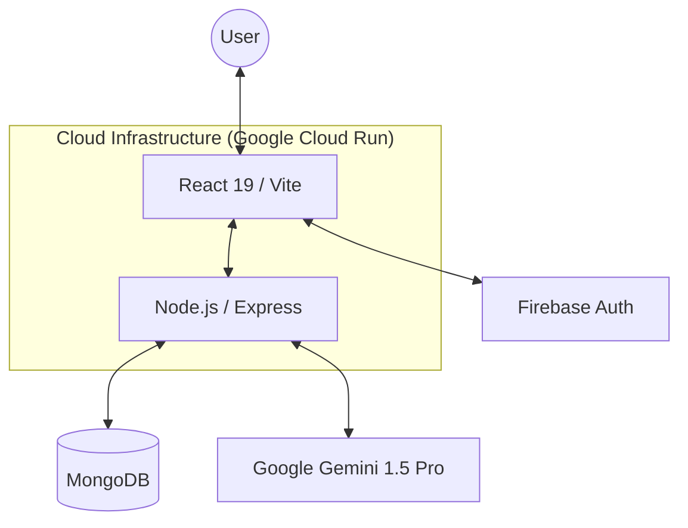

# 🧠 ExpenseMind AI - Smart Expense & Budget Advisor

ExpenseMind AI is a premium, full-stack financial assistant that leverages Google's **Gemini 1.5 Pro** to help you track spending, understand your financial behavior, and optimize your budget.


## 🏗️ Architecture Diagram



## 🚀 Key Features

- **📊 Dynamic Dashboard**: Real-time spending trends and category-wise breakdown using Recharts.
- **💬 AI Chat Advisor**: A personal financial assistant powered by **Gemini 1.5 Pro** via `@google/generative-ai`.
- **✨ AI Insights**: Automatic detection of unnecessary expenses, budget suggestions, and financial health scoring.
- **🎭 Spending Personality**: Behavioral analysis that classifies you as a "Saver", "Spender", or "Balanced" individual.
- **📈 Predictive Analytics**: AI-driven predictions for next month's spending.
- **🏆 Financial Health Score**: A gamified 0-100 score based on your saving habits.

## 🛠️ Tech Stack

### Frontend
- **React 19** with **Vite**
- **Tailwind CSS** (Premium UI/UX)
- **Firebase Auth** (Google Login)
- **Recharts** (Data Viz)

### Backend
- **Node.js & Express**
- **MongoDB** (Stored via Mongoose)
- **Google Generative AI SDK** (Gemini 1.5 Pro)
- **LRU Cache** (Optimized token usage)
- **Jest & Supertest** (80%+ Logic Coverage)

## ⚙️ Quick Start

### 1. Prerequisites
- Node.js (v18+)
- MongoDB (Running locally or Atlas)
- Google Gemini API Key

### 2. Environment Setup
Create a `.env` file in the `server/` directory:
```env
PORT=5000
MONGO_URI=your_mongodb_uri
GEMINI_API_KEY=your_google_gemini_api_key
```

### 3. Run with Docker (Recommended)
```bash
docker build -t expensemind-ai .
docker run -p 5000:5000 expensemind-ai
```

### 4. Local Development
**Server:**
```bash
cd server
npm install
npm run dev
```

**Client:**
```bash
cd client
npm install
npm run dev
```

## 🧪 Testing
We maintain a robust test suite using Jest.
```bash
cd server
npm test
```

## ♿ Accessibility & UI
- **ARIA Labels**: All interactive elements and charts include ARIA labels for screen readers.
- **Keyboard Navigation**: Full support for Tab-based navigation across the dashboard.
- **High Contrast**: Built-in support for high-contrast color palettes in charts.
- **Responsive Design**: Fluid layout that works from mobile to ultra-wide displays.

## 🔐 Security
- **OWASP Best Practices**: Implemented `helmet` for secure headers and sanitized inputs.
- **Zero Hardcoded Keys**: All secrets are managed via environment variables.
- **Error Handling**: Comprehensive try-catch blocks around all AI and Database operations.

## 📄 License
This project is licensed under the MIT License.

---
Built with ❤️ by Arun
